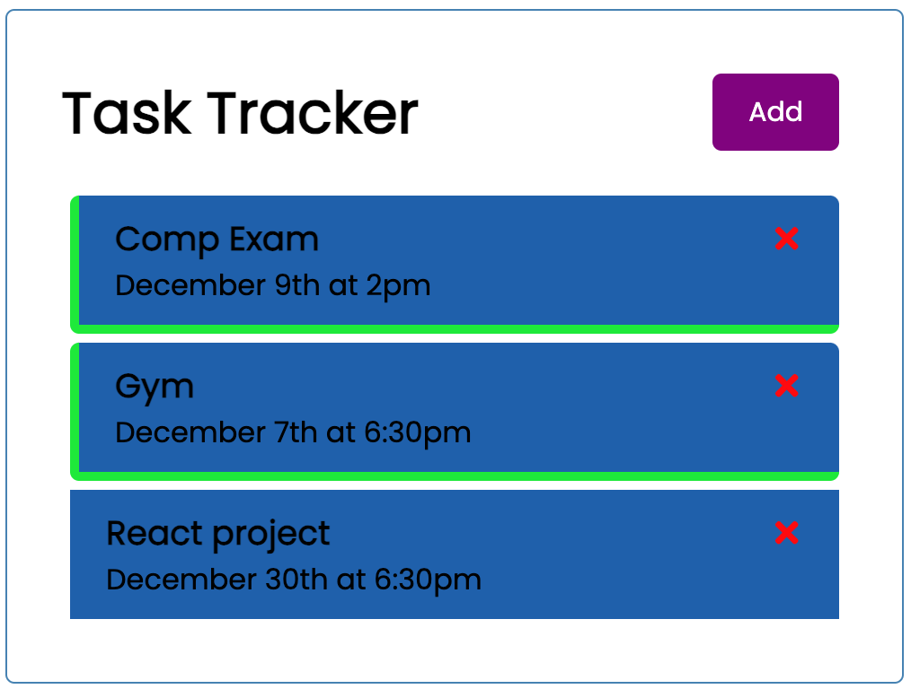

# React Task Tracker

This is a basic task tracker application built using React. It allows users to add, delete, and set reminders for tasks.

## Table of Contents

- [Features](#features)
- [Installation](#installation)
- [Usage](#usage)
- [Contributing](#contributing)
- [License](#license)

## Features

- Add new tasks with a title, day, and optional reminder.
- Delete existing tasks.
- Toggle task reminders on/off.

## Installation

1. Clone the repository: `git clone https://github.com/AbdulkarimMziya/ToDO_ReactApp`
2. Navigate to the project folder: `cd ToDo_App`
3. Install dependencies: `npm install`
4. Run the app: `npm run dev`
5. Open your browser and go to `http://localhost:5173/`

## Images

